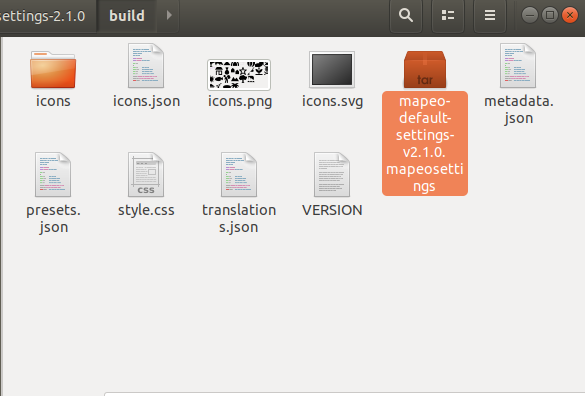
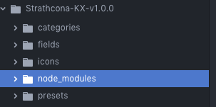

# Creating Fields

## Prepare folder structure for creating assets

### Using the file explorer

1. Download the [example configuration](https://github.com/digidem/mapeo-default-settings/).
2. Unzip the contents to a new folder using a program like [7zip](https://www.7-zip.org/).
3. Rename the folder from "mapeo-default-settings-2.1.0" to "mapeo-config-projectname".

### Using the terminal \(linux and mac\)

```text
wget https://github.com/digidem/mapeo-default-settings/archive/v2.1.0.zip 
unzip v2.1.0.zip 
mv mapeo-default-settings-v2.1.0 mapeo-settings-myprojectname 
```

## Configuration Contents

**These are the directories that live in the top level folder**

* fields
* icons
* presets

#### These are the files that live in the top level folder 

* defaults.json
* metadata.json
* package.json
* style.css

## Prepare .json Files

### In `fields` directory customize the `.json` files 

In the fields directory, each .json file needs a `key`, `type`, `label`, and `placeholder.` 

`type` can be one of `select_multiple`, `select_one`, `text`, or `textarea`

### In the `presets` directory, customize the `.json` files

In the presets directory, each .json file needs:

* a list of `fields` which should match the `key` created in the fields directory.
* `icon` must mach the name of an icon in the `icons` folder
* `name`will be the human-readable label shown to the user
* `geometery` must be a list of `point` ,`area`, and/or `line`

### Copy icons from previous section

The `icons` folder should have all of the icons you created from the previous section

## Package Config Assets for MAPEO

### Prep folder and build

Type, 'cd\`, then a space, then drag and drop the folder where the prepared assets are and press enter. It will look something like this

```text
cd /Users/jen/Documents/Dd_LOCAL_project-files/Dd-Tools/Mapeo/Presets/CREATION\\ LAB/Strathcona-KX-v1.0.0
```

You will then be ready to run scripts directly in the folder. 

```text
npm install
```

```text
npm run -s build
```

This -s tells npm to be silent, so that you only see errors that are meaningful to you.

You will see something like the following output. Errors will be highlighted in RED with hopefully some helpful description so that you can remedy the issue.

```text
→ Using version x.x.x. of mapeo-settings-builder
! Warning: no category json files found in /home/okdistribute/node_modules/mapeo-default-settings/mapeo-default-settings-2.1.0/categories
✓ Built presets and categories (37ms)
✓ Generated svg sprite for iD (544ms)
✓ Generated png sprite for Mapbox (81ms)
✓ Generated png icons for Mapeo Mobile (607ms)
✓ Successfully created file 'build/mapeo-default-settings-v2.1.0.mapeosettings' (total 1299ms)

```

 You'll also see  a `.mapeosettings` file inside of the `build` directory.



### What is a .mapeosettings file?

A `.mapeosettings` file is a **tar** file, similar to a zip file. You can see the contents of the file by changing the file extension to `.tar` and using any application that can extract tar files.

### Troubleshooting Checklist

Type the following into the terminal

```text
node -v
```

You need to be at least on Node version 8 for the mapeo-settings-builder to work properly. If you need help, review the 'Preparing Computer' section and ensure you're on the latest version of mapeo-settings-builder.

```text
npm install -g mapeo-settings-builder@latest
```

You also may want to delete node\_modules and install updated versions of the dependencies.



In Mac or Linux, in the terminal:

```text
npm install
```

If you're having more issues, please [open an issue on the GitHub repository](https://github.com/digidem/mapeo-default-settings/issues/new) or e-mail our support hotline.

