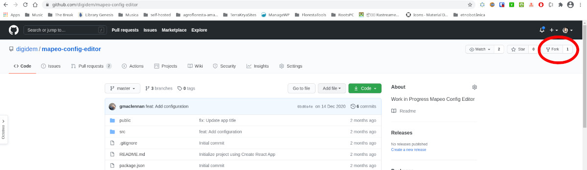
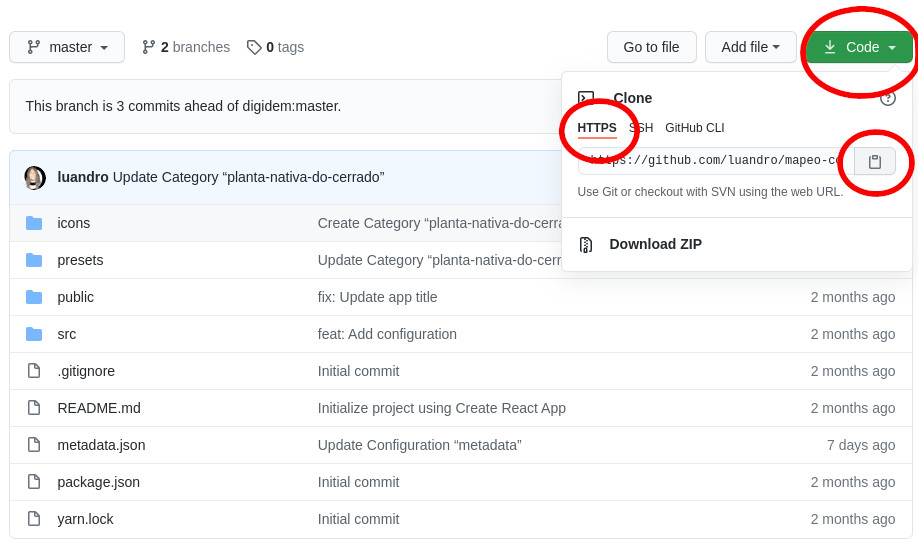
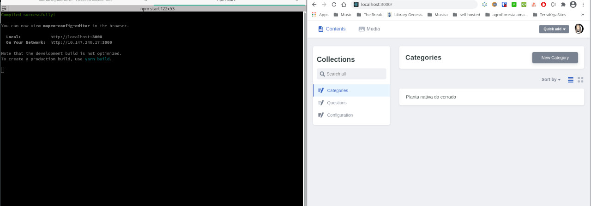

# Custom configurations

## Using the config editor
*Proof-of-Concept*

### Create your fork of the repository

You'll need a [Github](https://github.com) account for this, so go ahead and create one if you don't have one already. You'll also need to have `git` installed, but most machines already have it.

Navigate to the [Mapeo Config Editor repository](https://github.com/digidem/mapeo-config-editor) and on the top-right you'll see a **Fork** button which you can click.



Choose a name for your project. It's a good naming convention to name the repo with the name of the territory where the config will be used. Ex.: `mapeo-config-kalunga`

### Clone and install your fork

Now that you have your own fork, you can clone it by clicking on the `clone` button and choosing the `https` option.



Open up a terminal window and use `git clone https://github.com/your-repo.git`, changing the url to the one you copied from you Github fork. This will clone the project to your local machine.

Once the project finishes cloning, enter it using `cd your-repo`, where `your-repo` is the name of your project.

Now you can install the projet with `npm install`.

### Run the app

Once installation is done run it with `npm start`. The config editor app will start on [localhost:3000](http://localhost:3000) and will ask you to login using Github in order to use [Netlify]().



Now use the editor to create your own configuration presets and upload the icons that were created on the previous section. When saving the new configurations, they will automatically be updated on your Github repo.

### Next steps

If  everything went well, skip to the [Package Config Assets for MAPEO](#package-config-assets-for-mapeo) section.

### Troubleshooting

If you had problems with Github login, inside the `src/config.js` file, you can set the `repo:` option to:
```
const config = {
  backend: {
    name: "github",
    repo: "your-user-name/your-repo-name",
...
```
Where you'll use your Github username `/` the chosen project name for your fork. This will force the right repository in case it's not set correctly.

If you had any problems with the app, please consider [creating an issue](https://github.com/luandro/mapeo-config-editor/issues) on Github explaining your experience and please try creating your configurations [manually](#manually).


## Manually

### Prepare folder structure for creating assets

#### Using the file explorer

1. Download the [example configuration](https://github.com/digidem/mapeo-default-settings/).
2. Unzip the contents to a new folder using a program like [7zip](https://www.7-zip.org/).
3. Rename the folder from "mapeo-default-settings-3.3.0" to "mapeo-config-projectname".

#### Using the terminal \(linux and mac\)

```sh
wget https://github.com/digidem/mapeo-default-settings/archive/v3.3.0.zip 
unzip v3.3.0.zip 
mv mapeo-default-settings-v3.3.0 mapeo-settings-myprojectname 
```

### Configuration Contents

**These are the directories that live in the top level folder**

* `fields`
* `icons`
* `presets`

##### These are the files that live in the top level folder

* `defaults.json`
* `metadata.json`
* `package.json`
* `style.css`

### Customize `.json` Files

#### In the `fields` directory customize the `.json` files 

In the fields directory, each `.json` file needs a `key`, `type`, `label`, and `placeholder.` 

`type` can be one of `select_multiple`, `select_one`, `text`, or `textarea`

#### In the `presets` directory customize the `.json` files

In the prests directory, each `.json` file needs:

* a list of `fields` which should match the `key` created in the fields directory.
* `icon` must mach the name of an icon in the `icons` folder
* `name` will be the human-readable label shown to the user
* `geometery` must be a list of `point` ,`area`, and/or `line`
* `tags` are key-value pairs with attributes about an observation

### Copy icons from previous section

The `icons` folder should have all of the icons you created from the previous section

## Package Config Assets for MAPEO

### Building configuration file

On the terminal, if you aren't already in the project folder, type `cd`, then a space, then drag and drop the folder where the prepared assets are and press enter. It will look something like this:

```sh
cd /Users/jen/Documents/Dd-Tools/Mapeo/Presets/mapeo-settings-myprojectname
```

You will then be ready to run scripts directly in the folder.

If you installed `mapeo-settings-builder` on the first step you can simply run:
 ```sh
mapeo-settings-builder build --output myprojectname.mapeosettings --lang 'pt'
```

After `--output` set the output file and after `--lang` set the language of the presets.

Else, inside the directory run:

```sh
npm install
```
And then:

```sh
npm run -s build
```

`-s` tells npm to be silent, so that you only see errors that are meaningful to you.

You will see something like the following output. Errors will be highlighted in RED with some helpful description so that you can remedy the issue.

```sh
→ Using version x.x.x. of mapeo-settings-builder
! Warning: no category json files found in /home/okdistribute/node_modules/mapeo-default-settings/mapeo-default-settings-3.3.0/categories
✓ Built presets and categories (37ms)
✓ Generated svg sprite for iD (544ms)
✓ Generated png sprite for Mapbox (81ms)
✓ Generated png icons for Mapeo Mobile (607ms)
✓ Successfully created file 'build/mapeo-default-settings-v3.3.0.mapeosettings' (total 1299ms)

```

 A `.mapeosettings` file will have been created inside of the `build` directory or where `--output` was set too.


### What is a .mapeosettings file?

A `.mapeosettings` file is a **tar** file, similar to a zip file. You can see the contents of the file by changing the file extension to `.tar` and using any application that can extract tar files.

### Troubleshooting Checklist

Type the following into the terminal

```sh
node -v
```

You need to be at least on Node version 8 for the mapeo-settings-builder to work properly. If you need help, review the 'Preparing Computer' section and ensure you're on the latest version of mapeo-settings-builder.

```sh
npm install -g mapeo-settings-builder@latest
```

You also may want to delete node\_modules and install updated versions of the dependencies.


In Mac or Linux, in the terminal:

```sh
npm install
```

If you're having more issues, please [open an issue on the GitHub repository](https://github.com/digidem/mapeo-default-settings/issues/new) or e-mail our support hotline.

