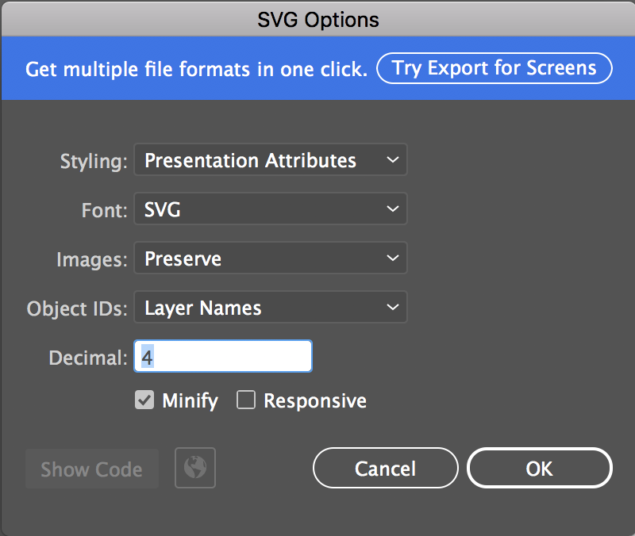
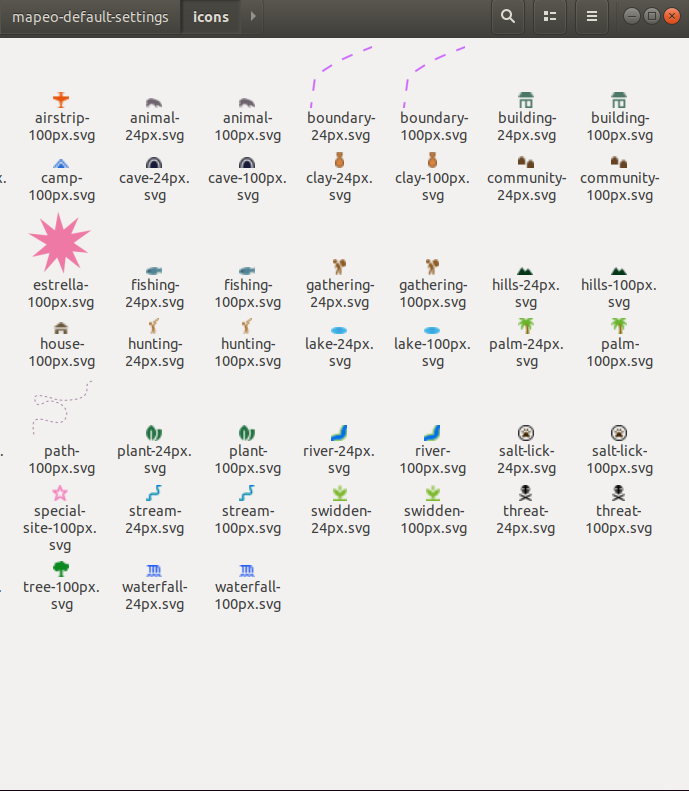

# Preparing Icons

## What is an icon?

Each of the presets you create needs to be assigned an icon, and these all need to be saved as `.svg` files.  You can assign the same icon to various presets, or they can each have their own individual one.

[See example icons](https://github.com/digidem/mapeo-default-settings/tree/master/icons) created for our default 'jungle' configuration.

## Creating Icons

Design icons as 100x100 pixel graphics that are clear when viewing at 100%.

### Using Adobe Illustrator

From Illustrator, File &gt; Export

* Select SVG
* With the artboard box ticked
* Additional settings as below. These are how Mapbox says to export icons for svgs to use on their maps too.



### Troubleshooting

If you have trouble viewing your icons, [check this troubleshooting guide created by Mapbox](https://docs.mapbox.com/help/troubleshooting/studio-svg-upload-errors/) or ask us [for support](../get-support.md).

## Naming icons

The icons need to read by MAPEO in two sizes: 100 and 24 pixels. For that reason there is a specific file naming convention:

* _name_\*\*-100px\*\*.svg 
* _name_\*\*-24px\*\*.svg

Each icon can be duplicated and renamed so that there is one of each. They are opened and read by the .json files in the "preset" folder. Verify that "name" is correctly entered where needed \(more on this in the next section\). The build script will process the pixel size suffix.

## Saving icons

Create a directory named `icons` and put all icons in there according to the above naming convention. 

The directory should look like this:

```text
$ ls icons/
airstrip-100px.svg  building-100px.svg  clay-100px.svg       fishing-100px.svg    house-100px.svg    palm-100px.svg   river-100px.svg         stream-100px.svg   tree-100px.svg
airstrip-24px.svg   building-24px.svg   clay-24px.svg        fishing-24px.svg     house-24px.svg     palm-24px.svg    river-24px.svg          stream-24px.svg    tree-24px.svg
animal-100px.svg    camp-100px.svg      community-100px.svg  gathering-100px.svg  hunting-100px.svg  path-100px.svg   salt-lick-100px.svg     swidden-100px.svg  waterfall-100px.svg
animal-24px.svg     camp-24px.svg       community-24px.svg   gathering-24px.svg   hunting-24px.svg   path-24px.svg    salt-lick-24px.svg      swidden-24px.svg   waterfall-24px.svg
boundary-100px.svg  cave-100px.svg      estrella-100px.svg   hills-100px.svg      lake-100px.svg     plant-100px.svg  special-site-100px.svg  threat-100px.svg
boundary-24px.svg   cave-24px.svg       estrella-24px.svg    hills-24px.svg       lake-24px.svg      plant-24px.svg   special-site-24px.svg   threat-24px.svg
```



