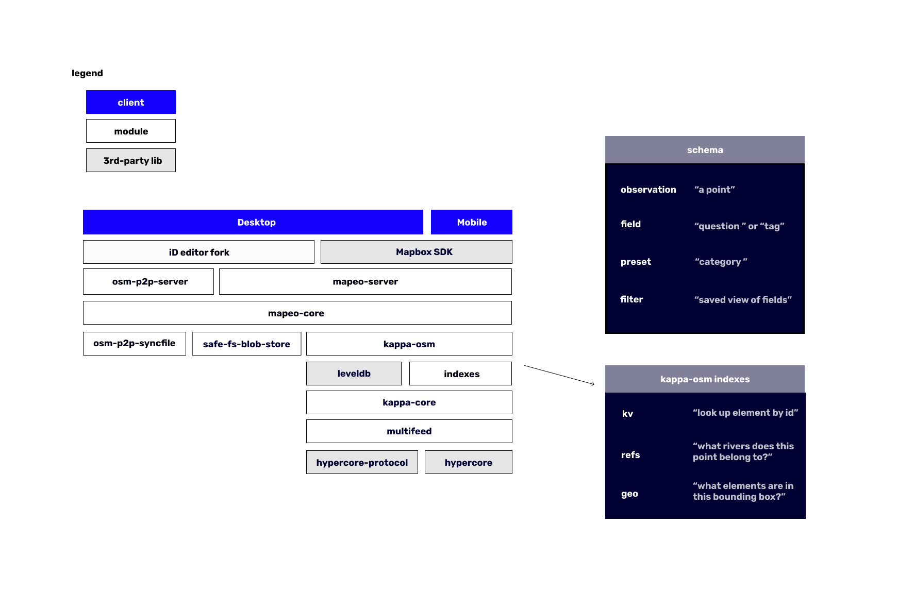

# Architecture Overview

Behind the scenes of the user interfaces for working with mapping and monitoring data, you'll find Mapeo's core infrastructure. 

**Schema**

1. **Observation.** Mapeo extends the OpenStreetMap specification to add 'Observations' -- a new data type that is like a node or point, but with extra metadata and media. 
2. **Field.** Called a 'question' \(ODK\) or 'tag' \(OSM\), a Field is how we structure metadata about Observations and OSM Elements. 
3. **Preset.** Called a 'Category' in the Mapeo interface, but in code we call this a 'preset.' This type defines a set of Fields and an Icon.
4. **Filter.** An expression that can be applied on the values in one or more Field across a set of observations. 

**Database** 

KappaDB is one of the fundamental primitives of Mapeo Core that handles indexing of data that isn't media \(i.e., it does not handle images\). KappaDB is a flexible database for peer-to-peer applications that we developed in 2018, and is considered stable. If you haven't yet, go ahead and [try the workshop](https://github.com/kappa-db/workshop) to familiarize yourself with how it works.

**Configuration**

Each 'project' has a set of configuration files. It is identified by a project key which is a shared secret amongst all devices. It authorizes devices to read and write to the database. There is no way at this time to revoke a configuration from a device remotely. Read more about configurations in the Preparing Mapeo Configurations page.



**Discovery**

Each device announces itself on the local network using MDNS. It announces itself using a hash of the project key, which is also called a _**discovery key**_**.** This means that 3rd-party observers will not be able to discern the project key. 

**Replication**

Replication requires advance knowledge of the project key. Replication will be refused if a peer's project key is not the same.

[Multifeed](https://github.com/kappa-db/multifeed) is the module that manages replication across multiple Mapeo devices. It depends upon [hypercore](https://github.com/mafintosh/hypercore), a distributed append-only log. Hypercore only allows one writer; multifeed syncronizes a set of hypercores -- by a variety of authors -- across all devices with the same project key. This forms the basis for creating a view of a single dataset that incorporates changes from multiple writers across multiple feeds.

**Media**

A project also contains media files which are handled separately from the multifeed module, which concerns itself primarily with structured data \(e.g., json, protobuf, etc\). Media files are replicated using [blob-store-replication-stream](https://npmjs.com/blob-store-replication-stream). This is a simple module that announces the list of files available on both sides of a duplex stream, and then replicates the files that are missing. 

Clients can provide filters for which files they want to accept on either end; by default, Mobile to Mobile sync does not send original images, only preview and thumbnail sizes. Original images are always syncronized from Mobile to Desktop. 

