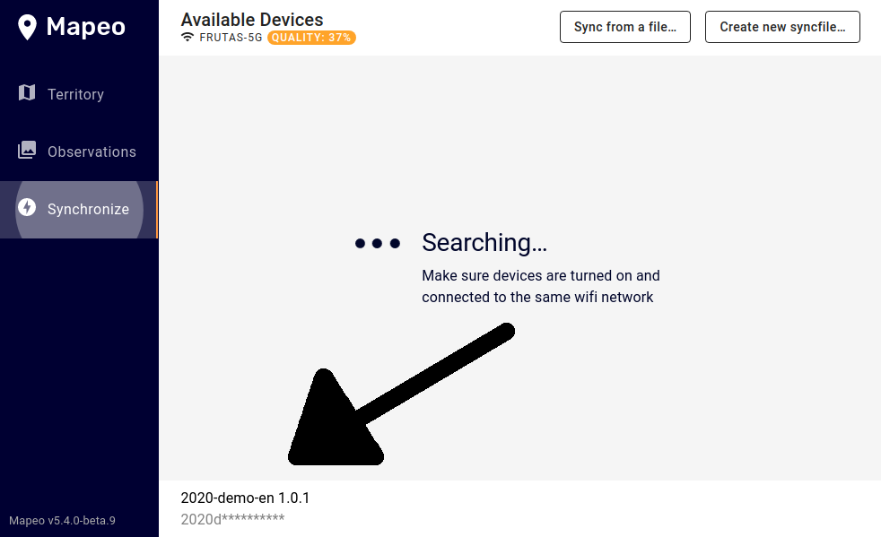

# Frequently Asked Questions

## What happens if Mapeo loses financial support? **Will my data be inaccessible?**

Mapeo is built with long-term sustainability as a focus. This goes beyond financial sustainability -- we ensure that no single entity or technology is responsible for data storage or access. 

Mapeo does not lock ****your data into a particular data format. You can easily move your data around, and it's kept in it's original form. Mapeo can export data to [SMART](http://smartconservationtools.org/download/), Shapefile, CSV, and GeoJSON.  You'll never be locked into using Mapeo software.

## I ran into an error. What do I do?

If you see an error message in Mapeo, please open a bug report on GitHub, or contact us in our support channels.



## **I'm having trouble synchronizing my data!**

Make sure your Mapeo applications are on the latest stable versions, [downloaded from the Mapeo website](https://mapeo.world/) or Google Play. 

Ensure that all devices are using the same configuration and project key. You can determine this by looking at the bottom of the syncronization screen in Desktop;

And the Observations-&gt;Settings-&gt;Project Configuration screen on mobile.

If you continue to have issues, [please let us know and get support from our technical team.](get-support.md)

## Does Mapeo use a Blockchain?

Mapeo uses secure peer-to-peer technology with a distributed ledger, which does not include a public blockchain or consensus. 

Public blockchains are designed for a scenario where public transactions must be mediated between participants which are all potentially malicious. These “trustless” transactions are the key assumption of a blockchain that distinguishes it from peer-to-peer technology. 

Applications like Mapeo assume that data is managed by the community generating it -- and **some of that data may never be publicly accessible.** Mapeo's approach, in contrast, creates a closed group, where data creators are also data stewards, managing their own data and controlling who has access. We take security seriously and maintain protections from third-party attacks such as targeted hacks and surveillance by third-parties. For users of Mapeo, privacy is critical for protecting their ancestral knowledge and environmental monitoring information  until it’s ready to be shared with trusted partners. 

For more information, [read this blog post](https://www.digital-democracy.org/blog/blockchain/) and [this paper from Article 19](https://www.article19.org/resources/blockchain-technology-alone-cannot-protect-freedom-of-expression) about why blockchain is not a recommended tool for human rights and freedom of expression.

## 

