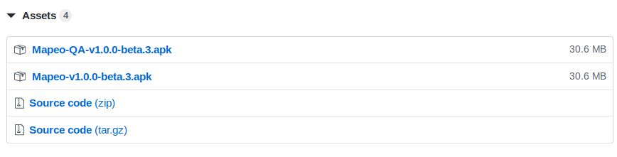
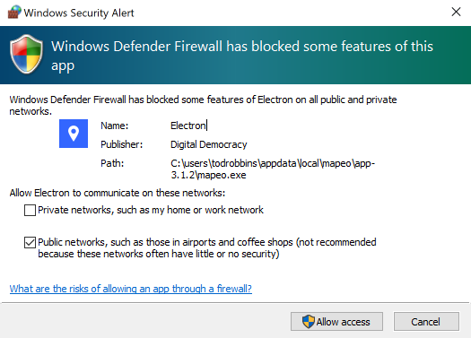

# Installation

## Install on Android \(beta\)

1. [Download for Mobile](https://www.github.com/digidem/mapeo-mobile/releases)
2. Navigate to the above page on your mobile device and click 'assets' under the most version.
3. Download the `.apk` file onto your phone using the web browser.
4. Open the `.apk` file in the the Downloads folder of your phone.

## Install on PC

1. [Download for PC](https://www.digital-democracy.org/mapeo/latest/windows)
2. Find the downloaded Mapeo Installer \(e.g. `Installar_Mapeo_Windows.exe`\) and double click
3. Wait for installer to finish, which will open the Mapeo on completion
4. You may need to click **Allow Access** if you have Windows Defender enabled

## Install on Mac

1. [Download for Mac](https://www.digital-democracy.org/mapeo/download_mac/)
2. Find the downloaded Mapeo Installer and double click
3. Drag the Mapeo icon into your **Applications** folder
4. Find Mapeo in your **Applications** folder and right click to open
5. Click **Open**—this verification only happens the first time you use Mapeo

## Install on Linux

1. [Download for Linux](https://www.github.com/digidem/mapeo-desktop/releases)
2. Pick the release that works for you. We recommend using the `.deb` package for most systems.
3. Double-click the `.deb` installer.

