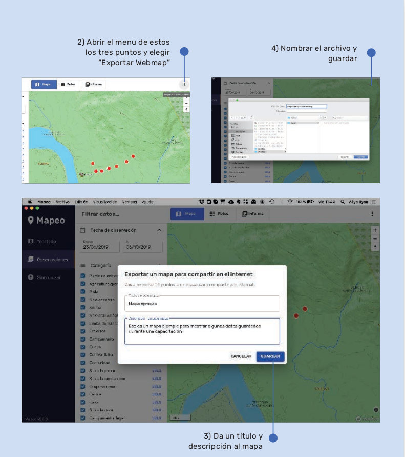
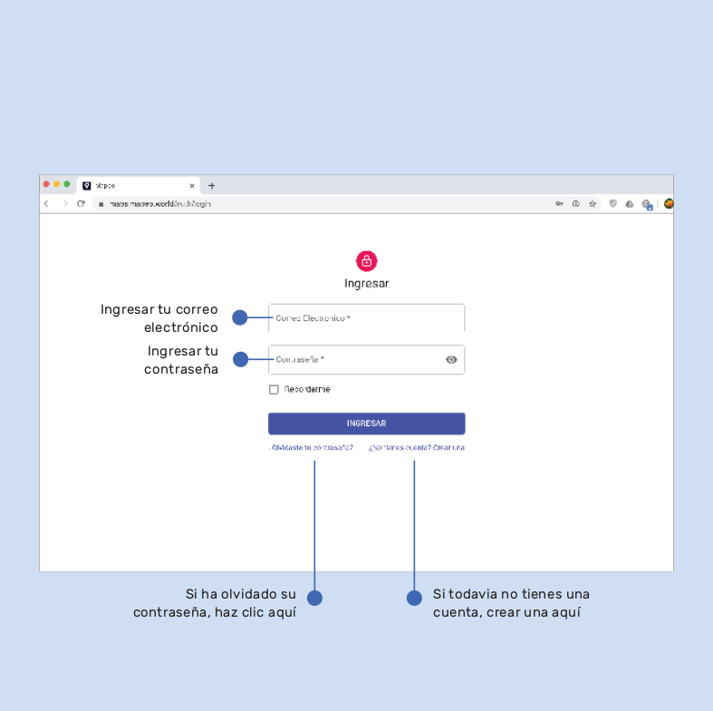
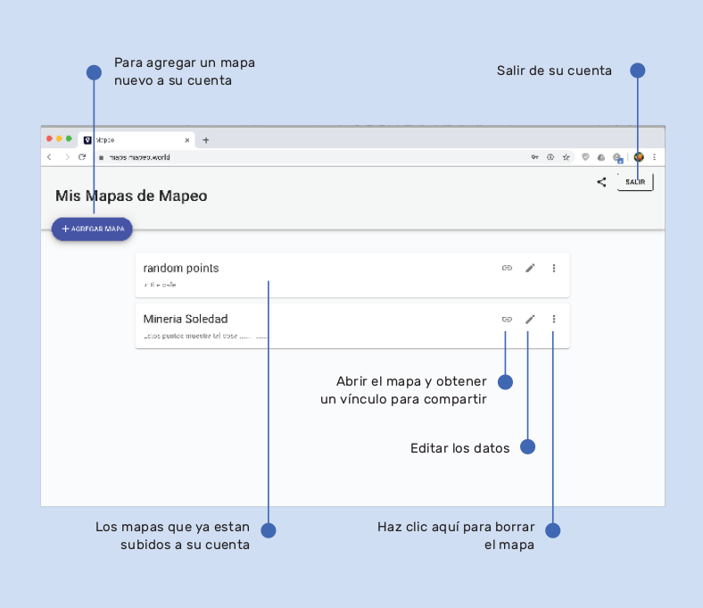
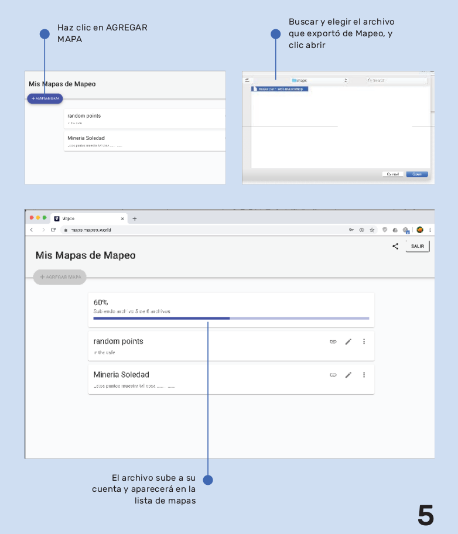
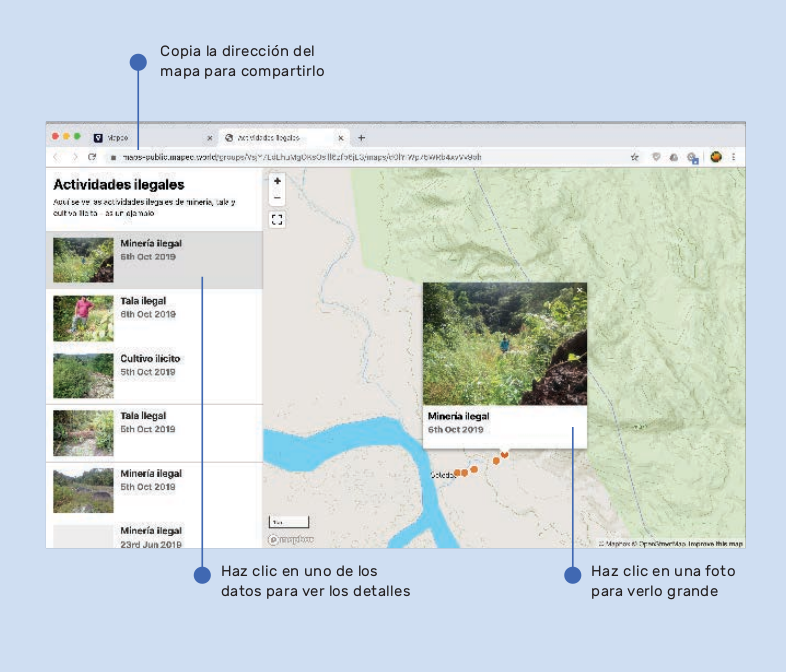

# Exporting data to web

## How to export data to create a map accessible on the Internet

It's possible to export a data file or a piece of data from Mapeo and upload them to a map on the Internet. The map can be shared and used in campaigns or for other more interactive formats.

1. Inside Mapeo Desktop, filter data until you have the data that you want to appear in the map on the Internet.
2. Choose "Export Webmap" from the menu in the top right corner of the window.
3. Write a title and description of the map, these will appear on the map online.
4. Name and save the file.

#### Open a Web Browser, like Firefox or Chrome.

1. Open [https://maps.mapeo.app](https://maps.mapeo.app)
2. Enter your account details or create a new account if it's your first time.

#### Your maps

1. The window shows a list of maps that you've already uploaded to the Internet in your account.
2. It's possible to edit the map data, add new maps, delete maps, and share public links to the maps to other people.

#### Add a new map

1. To add a new map, make a click on ADD MAP
2. Choose a file that was exported from Mapeo.
3. The map will be uploaded with your data and media.

**View the map in a website.**

1. Click the symbol to the side of the map which says Public Link.
2. The map will open in a new window.
3. To share with others, copy the web address \(URL\) of the map and share with your networks or website.
4. You can zoom in and out of the map.
5. Click on a photo to the left to open details.
6. To view larger, click the photo in the map.

